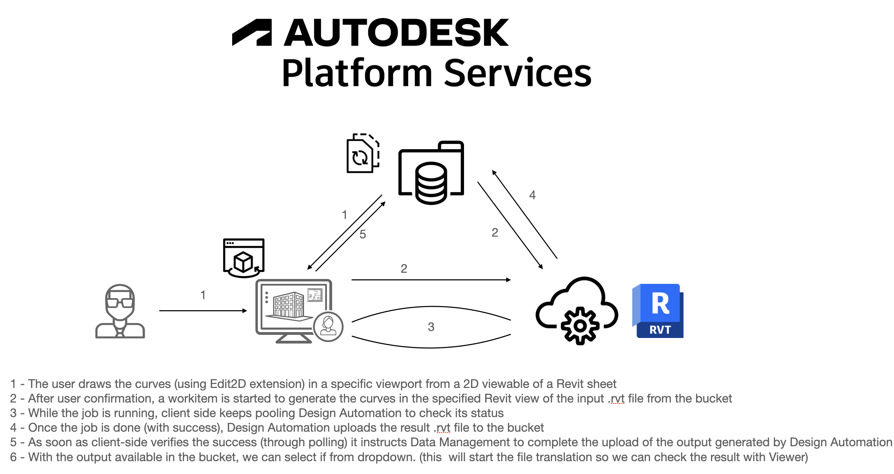

# Viewer 2d view to Revit view (using Edit2d extension and Design Automation for Revit)

# Description

This repo contains two projects that you can use to draw modelcurves in your Revit file from Viewer.

Both are under edit2d2da4r folder:

- DrawPolyLine project is a appbundle that takes the inputs (file, points and Revit view name) and generates a new .rvt file with the curves added
- simpleviewer is a project that leverages [Simple Viewer Tutorial](https://forge-tutorials.autodesk.io/tutorials/simple-viewer/) with a few modifications in order to triger a DA4R workitem from a polyline drawn in Viewer scene using the [Edit2D Extension](https://forge.autodesk.com/en/docs/viewer/v7/developers_guide/advanced_options/edit2d-setup/). To make this work, you need to draw the polilyne inside a viewport from a sheet view (and the view from the viewport need to be available as a translated viewable of the input model).
Before taking advantage of this sample, you need to create an appbundle with the content from the DrawPolyLine project in this repo (feel free to modify it's logic').

The proccess is just like in the diagram below.

Go throw each project folder to get more details.

## [Demo Video](https://youtu.be/Hwf2kOwfy2I)

## Diagram

## License

This sample is licensed under the terms of the [MIT License](http://opensource.org/licenses/MIT). Please see the [LICENSE](LICENSE) file for full details.

## Written by

João Martins [@JooPaulodeOrne2](http://twitter.com/JooPaulodeOrne2), [Forge Partner Development](http://forge.autodesk.com)
